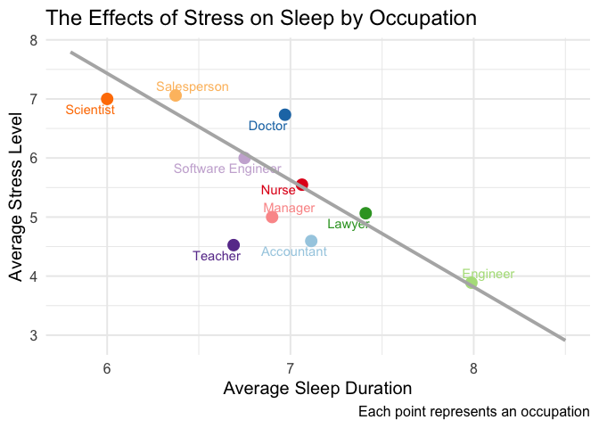
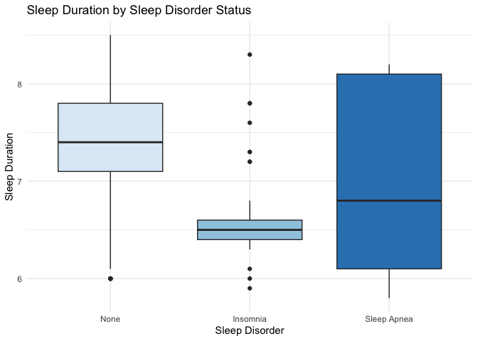

# Read Me

## Sleep Health and Lifestyle Analysis

### Project Overview

This project analyzes how lifestyle and health factors influence sleep
duration and sleep quality using the Sleep Health and Lifestyle Dataset
from Kaggle. The dataset contains information on 374 individuals across
10 occupations, including variables related to sleep habits, stress,
BMI, physical activity, and sleep disorders.

### Research Question

How do occupation, stress level, BMI category, physical activity, and
sleep disorders affect sleep duration and sleep quality?

### Variables Used:

- Gender
- Age
- Occupation
- Sleep Duration
- Quality of Sleep
- Physical Activity Level
- Stress Level
- BMI Category
- Sleep Disorder
- Heart Rate

### Key Findings

- Occupations with shorter average sleep duration tend to report higher
  average stress levels.
- Individuals with insomnia generally sleep fewer hours than individuals
  without a sleep disorder.
- Individuals with sleep apnea show the greatest variability in sleep
  duration.
- Higher BMI categories are associated with greater prevalence of sleep
  disorders, especially sleep apnea.
- Sleep disorder prevalence varies by occupation, with some occupations
  showing stronger patterns of insomnia or sleep apnea.

## Primary Visualizations

### Stress and Sleep by Occupation

This plotly visualization shows the negative relationship between
average sleep duration and average stress levels across occupations.

This boxplot compares sleep duration across sleep disorder groups.

### Interactive Shiny App

This project includes a Shiny app that allows users to:

- Filter occupations

- Select custom x and yaxis variables

- Generate scatterplots of sleep-related variables

- View summary statistics tables

- Explore sleep disorder distributions
